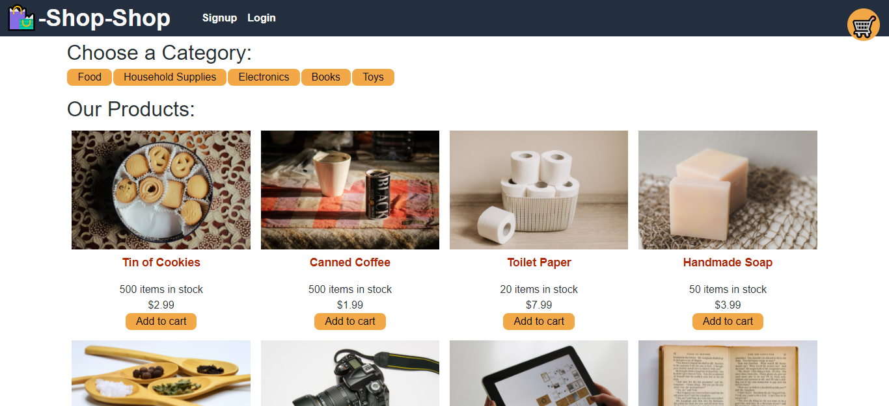

# Redux Shop

## Description

This is a e-commerce site built in React that has been refactored to use Redux for state management.

## Screenshot

## Table of Contents

- [Installation](#installation)
- [Usage](#usage)
- [Demo](#demo)
- [License](#license)

## Installation

Clone the project then `npm run seed` and start by running `npm start`.

## Usage

This project can be used as a starter for any kind of online store. Just update the database with your own information and provide image assets.

## Demo

A working deployment can be found at https://bluesatyr-redux-shop.herokuapp.com/

## License

This project uses the MIT License. More info about this license can be found at https://opensource.org/licenses/MIT

## Questions

For additional information on this project contact me by email at shawnevans.music@gmail.com or visit my GitHub page at https://github.com/bluesatyr.
